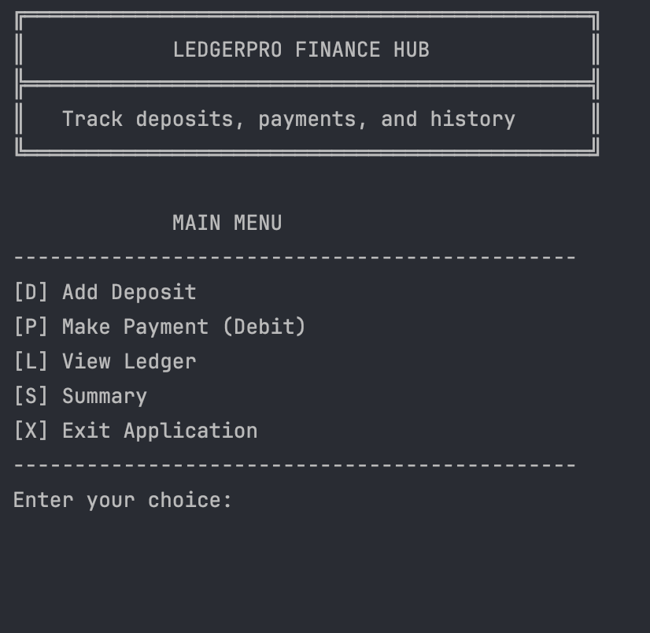
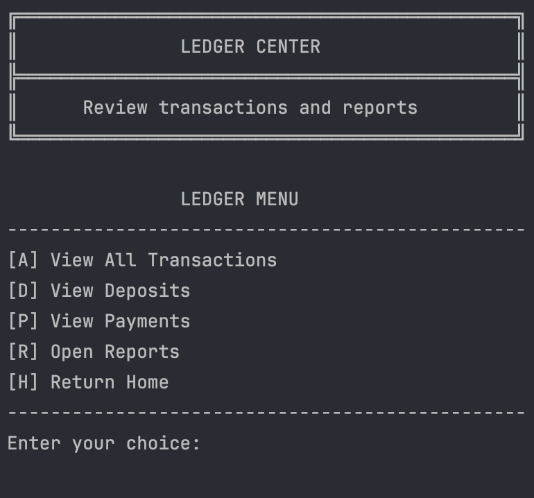
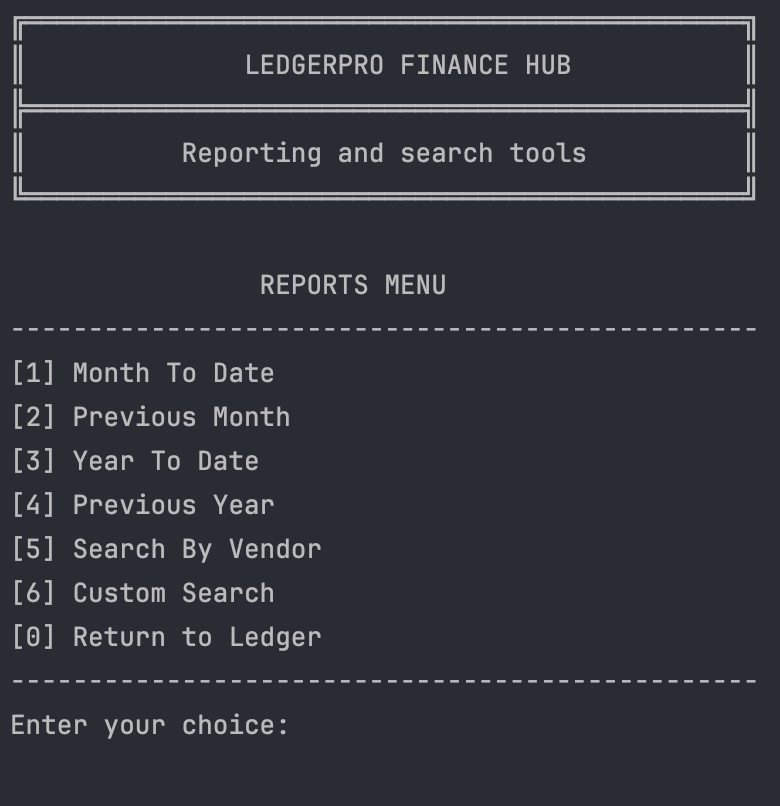
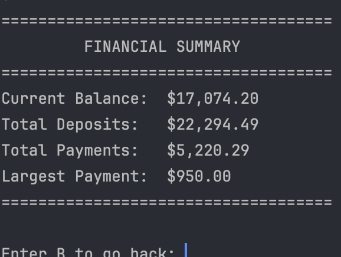

# LedgerPro Finance Hub

## Overview
LedgerPro Finance Hub is a Java command-line application. The program allows users to record financial transactions, including deposits and payments, and store them in a transaction file. It also gives users the ability to view their ledger, search transaction history, run reports, and see a financial summary.

## Features
- Add deposits
- Record payments
- Save transactions to a CSV file
- View all transactions
- View only deposits
- View only payments
- Search transactions by vendor
- Filter transactions by date, description, vendor, and amount
- View month-to-date, previous month, year-to-date, and previous year reports
- Display a financial summary with balance, total deposits, total payments, and largest payment

## Technologies Used
- Java
- IntelliJ IDEA
- File I/O
- ArrayList
- LocalDate and LocalTime
- GitHub

## How the Program Works
When the application starts, the user is shown a main menu with options to add a deposit, make a payment, view the ledger, open the summary page, or exit the program.

The ledger section allows the user to:
- View all transactions
- View only deposits
- View only payments
- Open the reports menu

The reports section allows the user to:
- View month-to-date transactions
- View previous month transactions
- View year-to-date transactions
- View previous year transactions
- Search by vendor
- Use custom filters

The summary section shows:
- Current balance
- Total deposits
- Total payments
- Largest payment

## Project Structure
- `TrackerApp.java` - contains the main program logic and menus
- `Transaction.java` - stores transaction data
- `transactions.csv` - stores saved transaction records
- `src/main/resources/` - contains the transaction file used by the program

## Interesting Parts of the Code
This project uses methods to keep the program organized and easier to read. Some methods are used for input validation, some are used for saving and loading transactions, and others are used for searching, filtering, and displaying reports.

The program also uses:
- `ArrayList<Transaction>` to store transaction records after reading them from the file
- `LocalDate` and `LocalTime` for handling dates and times
- `BufferedReader` and `BufferedWriter` for reading from and writing to the CSV file

## Challenges
One challenge in this project was handling different filters for transactions, such as start date, end date, vendor, description, and amount. Another challenge was making sure deposits stayed positive and payments were stored as negative values.

I also had to make sure user input was validated correctly so the program would not crash when the wrong date, time, or number format was entered.

## Future Improvements
- Add better formatting for transaction output
- Allow partial vendor or description searches
- Improve the custom search experience
- Add better exception handling
- Create a GUI version in the future

## Screenshots

### Main Menu

### Ledger Menu

### Reports Menu

### Financial Summary

## Author
Sheku Koroma